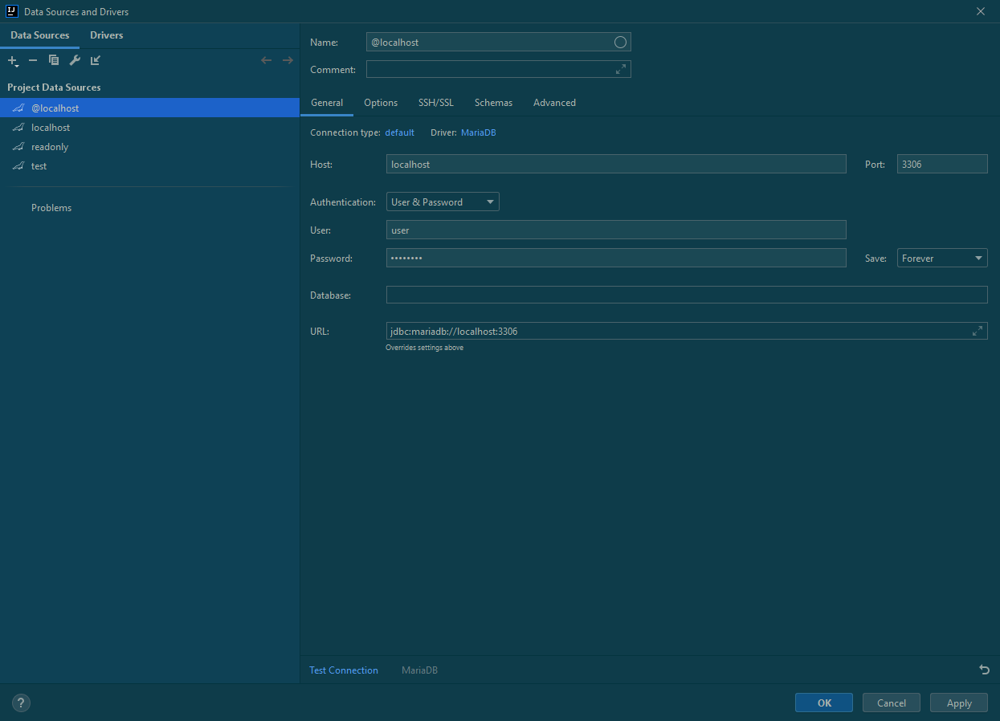
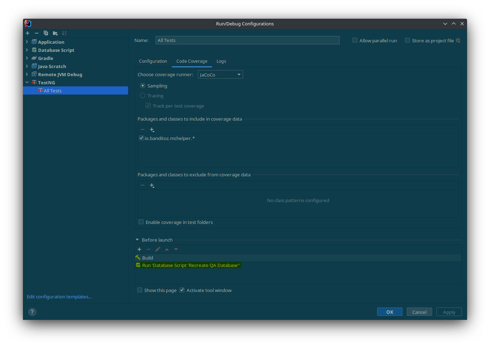

# How to configure IntelliJ Ultimate to run TestNG tests with database support

On GitLab's CI/CD, the test task will do the following:

1. Install Postgres.
2. Create a dummy database to run tests on.
3. Run the unit tests, configured to use the dummy database.

If you want to run all tests before you push it to GitLab for testing by CI, you can do the following to mimic a
dummy/QA database. As this uses IntelliJ's database tools, you'll need its ultimate edition. (Although you could
probably get away by using a shell script instead. Skip the ahead sentence if so.) You will also need to add the data
source you wish to use to test  against into IntelliJ. Here's an example (Click the plus to add a new Postgres data
source):


## The Run Configuration

1. Create a new *Database Script* run configuration against your target data source with the following SQL script:

```sql
DROP SCHEMA IF EXISTS automation CASCADE;
CREATE SCHEMA automation AUTHORIZATION mchelper_test;
```

2. Right-click the `test` package, and do `More Run/Debug -> Modify Run Configuration...`. This will create a default
   TestNG run configuration that you edit later.
3. In the `Environment Variables` field, punch in your database config for the unit tests to use. Here's an example:
   `HOST=192.168.0.136;DB=mchelper;USER=mchelper_test;PASS=password;SCHEMA=automation`. Replace the
   variables with your relevant values.
4. Under `Before Launch`, press `Run Another Configuration` and then your database script.

Final example:


## Configuring with coverage

If you wish, you can also run your test configuration with coverage (the shield icon). To do this, on the Coverage tab
of the run configuration, change the runner to JaCoCo (as that's what the CI script uses.)

Here's an example:
